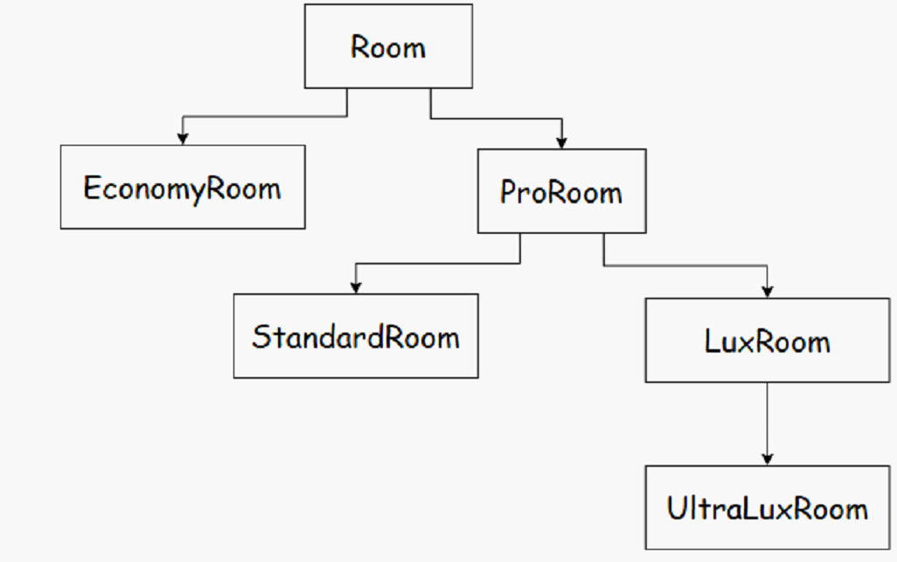

## Задание № 3
Создать класс Room с следующими полями:
- Целочисленное, номер комнаты 
- Целочисленное, максимальное количество человек в комнате
- Целочисленное, цена за ночь 
- Логическое, забронирована ли комната   

Добавить конструкторы (какие нужны для удобства создания объектов, количество человек например можно случайно генерировать).   
Реализовать следующую иерархию наследования, в каждом дочернем классе только вызов родительского конструктора.
   

Запретить создание объектов типа Room и ProRoom.   
Создать интерфейс RoomService с тремя методами:   
- clean (почистить комнату)
- reserve (зарезервировать комнату)
- free (освободить комнату)   

Интерфейс должен быть параметризован обобщенным типом (дженериком) только для типа Room и его наследников.  

Создать класс и имплементировать созданный интерфейс. Реализовать все
методы интерфейса, реализация не важна, единственное не забудьте при
бронировании и освобождении комнаты изменять поле комнаты, которое
отвечает за то занята ли комната или нет.   
Создать кастомную непроверяемую ошибку и выбрасывать её при попытке
забронировать комнату, которая уже забронирована (поле имеет значение
true).   
Протестируйте возможность использования сервиса для любого экземпляра
комнаты.   
## Доп. задания:
- Добавить перечисление Prices и хранить в нем цены на комнаты,
задавать цены на комнату с помощью перечисления.
- Добавить интерфейс LuxRoomService который имеет один новый метод
  foodDelivery (доставка еды). Параметризовать типом LuxRoom и его
  наследниками. Создать новый класс и реализовать интерфейс. Новый
  класс должен иметь реализацию всех методов интерфейса RoomService
  (ведь люксовые комнаты тоже комнаты и должны иметь базовый
  функционал) и также метод для доставки продуктов. Подумайте как это
  можно сделать (есть несколько вариантов). Проверьте, что нельзя в
  новом сервисе заказывать доставку еды из не люксовых комнат.

  
## Технологии:
Java 21
